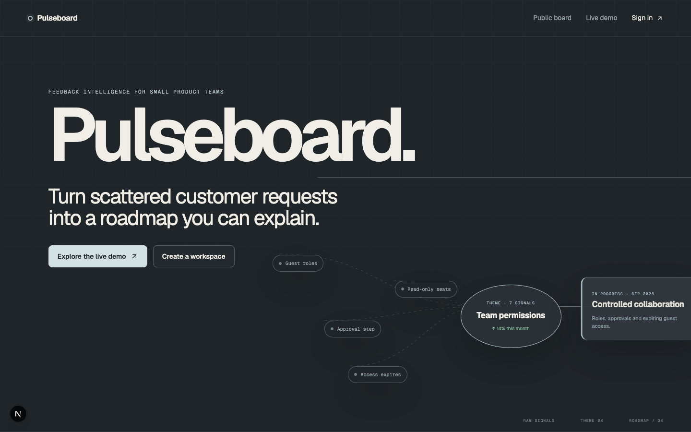
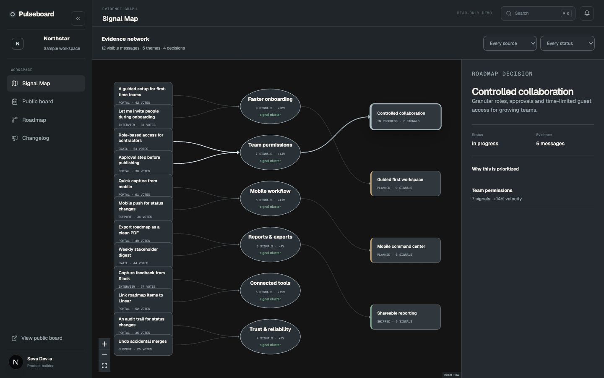
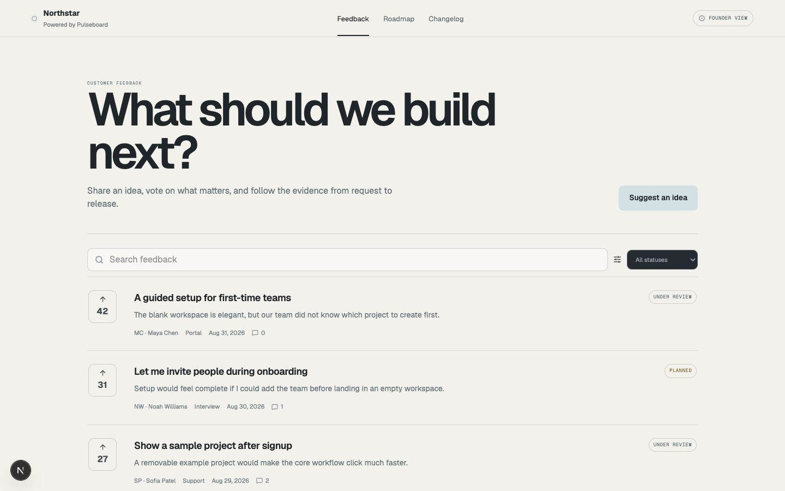

# Pulseboard

> Turn scattered customer requests into a roadmap you can explain.

Pulseboard is an independent concept SaaS for indie hackers and small product teams. It combines a public feedback board, founder triage workspace, roadmap, changelog and an explainable **Signal Map** that keeps the path from customer language to product decision visible.



## Why it exists

Feedback tools are good at collecting messages, but prioritization often becomes an invisible score. Pulseboard treats evidence as a product surface: AI can propose semantic links, while a founder confirms or rejects every relationship before it affects the roadmap.

The central workflow is:

`feedback → semantic suggestion → founder confirmation → theme → roadmap → shipped update`



## Product surfaces

- Marketing landing with product-led storytelling and reduced-motion support.
- Public feedback board with search, status filters, voting and conversations.
- Founder inbox for source-aware triage and status transitions.
- Interactive Signal Map built with React Flow, plus an accessible linear mobile view.
- Evidence-backed roadmap and public changelog.
- Multi-tenant workspaces with owner/editor roles and invite links.
- GitHub OAuth and email magic-link authentication through Supabase.
- `gte-small` embeddings in a Supabase Edge Function with human confirmation.
- Read-only `/demo` experience backed by 36 clearly labelled sample requests.



## Stack

- Next.js 16 App Router, React 19 and TypeScript
- Tailwind CSS 4 with custom design tokens
- React Flow for the evidence graph
- Motion for React for restrained landing motion
- Supabase Postgres, Auth, Row Level Security, Edge Functions and `pgvector`
- Zod validation, Vitest unit tests, Playwright E2E tests and pgTAP database tests
- Self-hosted Geist Sans and Geist Mono

## Local setup

```bash
npm install
cp .env.example .env.local
npm run dev
```

The marketing site and read-only demo work without environment variables. Persistent workspaces require:

```env
NEXT_PUBLIC_SITE_URL=http://localhost:3000
NEXT_PUBLIC_SUPABASE_URL=
NEXT_PUBLIC_SUPABASE_PUBLISHABLE_KEY=
```

For a local Supabase stack, install Docker and run:

```bash
npx supabase start
npx supabase db reset
```

The repository pins the Supabase CLI as a dev dependency. The first migration creates the complete schema, explicit Data API grants, indexes, views, helper functions and RLS policies. `supabase/seed.sql` creates the sample workspace.

## Verification

```bash
npm run typecheck
npm run lint
npm test
npm run test:e2e
npm run test:db
npm run build
```

`test:db` requires a running local Supabase stack. The remaining checks run independently of Supabase.

## Security model

- Every tenant-owned row carries `workspace_id`.
- RLS is enabled on every public table.
- Public reads are limited to public boards, roadmap items and published changelog entries.
- Users can write feedback, comments and votes only as their authenticated `auth.uid()`.
- Editors manage product content only inside their workspace; owners manage members and invitations.
- The demo workspace is immutable at the policy layer.
- The browser receives only the publishable key. Secret/service-role credentials remain server-side.
- The Edge Function validates the user token and workspace membership before privileged embedding writes.

More detail: [architecture](docs/architecture.md).

## Routes

| Surface | Routes |
| --- | --- |
| Marketing | `/`, `/login`, `/onboarding` |
| Live demo | `/demo`, `/demo/app/map`, `/demo/roadmap`, `/demo/changelog` |
| Public product | `/feedback/[workspaceSlug]`, post, roadmap and changelog routes |
| Founder app | `/app/[workspaceSlug]/inbox`, map, roadmap, changelog and settings |

## Design direction

The visual thesis is a dark editorial control room where scattered customer signals converge into a calm roadmap. The app uses graphite surfaces, soft blue evidence paths, one KPI strip and working tables only where dense information is useful. The public board deliberately switches to a warm paper surface so the customer-facing experience feels distinct from the founder workspace.

The admin information architecture was informed by the MIT-licensed [Next Shadcn Dashboard Starter](https://github.com/Kiranism/next-shadcn-dashboard-starter): compact route-aware navigation, a sticky utility header, keyboard skip-link and dense filter toolbar. Pulseboard’s implementation, product model and visual system are original and do not include its Clerk or shadcn application code. See [third-party notices](THIRD_PARTY_NOTICES.md).

## Portfolio note

Pulseboard is a concept product designed and built by **Seva Dev-a**. Sample customer names, requests and metrics are fictional and are labelled as sample data. See the concise [case study](docs/case-study.md) and ready-to-use [build-in-public posts](docs/build-in-public-posts.md).

## License

MIT © 2026 Seva Dev-a.
